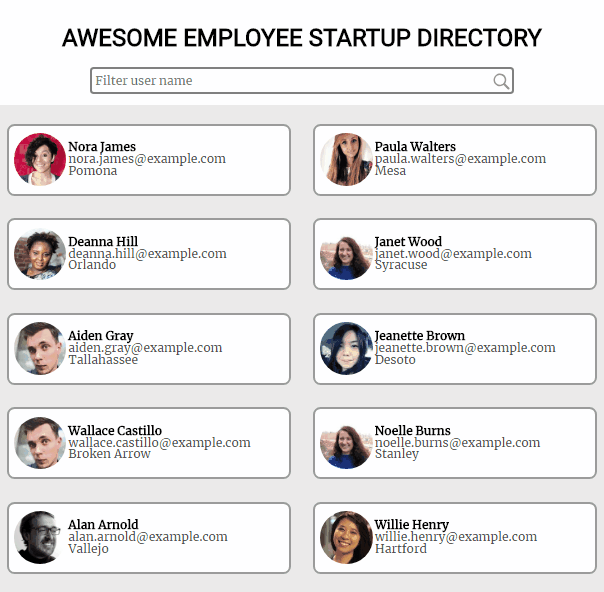

# treehouse-frontend-project08
TreeHouse FrontEnd Project 8 - Use an API to Create an Employee Directory

[Click here](https://canpu.github.io/treehouse-frontend-project08) to view the demo.

## Brief Introduction

* This webpage display an imaginary list of employees.
* The page layout is made by CSS grid.
* The user can click an employee to view more details in a modal window.
* The user can navigate through all employees in the modal window by either clicking the left or right arrows or by using keyboards.
* The user can filter employees by their names in the searchbox.

## Techniques Involed

* HTML
* CSS
* Sass
* JavaScript
* jQuery
* AJAX

## External APIs

* [Random User Generator](https://randomuser.me/documentation)

